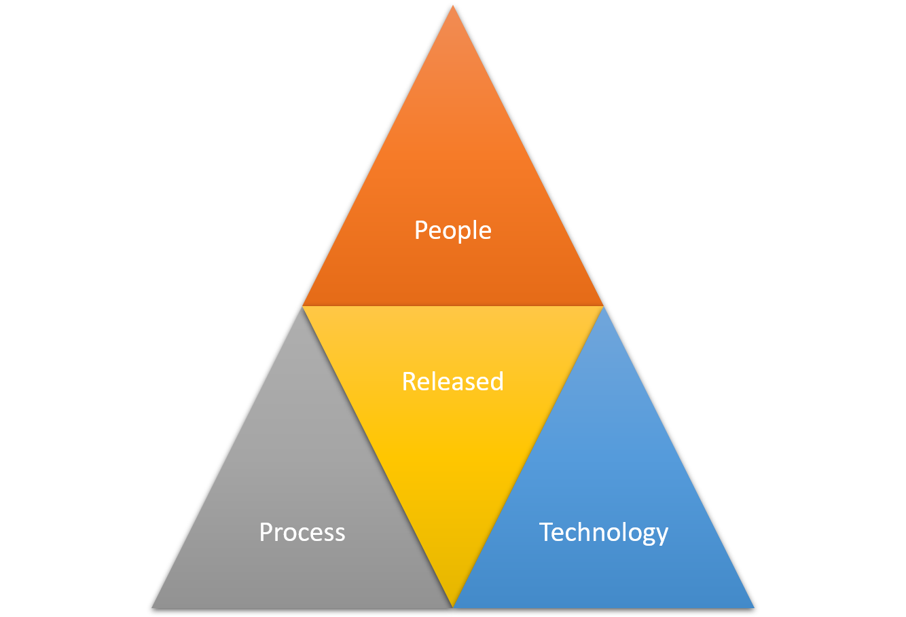

[Home](README.md) | [Why](why.md) | [Pillars](pillars.md) | [Systems](systems.md) | [Team](team-model.md)

# Introduction to the Released Method

Welcome to the Released Method, a comprehensive approach to managing and delivering large-scale software systems. Originating in the era of agile methodologies' emergence, the Released Method combines elements of various software development strategies. Its primary focus is to synergize the facets of a software product team, ensuring delivery of high-quality software that aligns with customer needs and expectations.

The Released Method is not just about processes and technologies; it fundamentally relies on people. It necessitates a team equipped with both the technical skills relevant to their roles and strong communication abilities. This dual focus on expertise and collaboration is key to the method's effectiveness.

Moreover, technology plays a crucial role. Although the method's creator has preferred technology stacks, the Released Method is versatile, adaptable to various technological combinations. For detailed technology requirements and recommendations, refer to the technology reference architecture.

The diagram below illustrates the **People, Process, Technology** triangle, a model that emphasizes the importance of balancing these three elements in a project. The Released Method aims to achieve this balance by focusing on:

| Area     | Investment                                                                                   |
|----------|----------------------------------------------------------------------------------------------|
| People   | Utilizing an effective team model and ensuring all critical functions are competently staffed.|
| Process  | Implementing the pillars of the Released Method to streamline and optimize processes.          |
| Technology | Integrating comprehensive solutions to meet the system requirements of the method.          |

## History of the Released Method

The Released Method's inception can be traced back to the author's experience at Microsoft around the millennium change. This period marked a pivotal shift in the software industry's approach, moving away from the traditional Waterfall Method, which was often misinterpreted from Dr. Winston W. Royce's concepts. The industry sought to rectify decades of misaligned process application, leading to the development of methodologies like Xtreme Programming, Scrum, and others.

While some practices in these methodologies were considered unconventional, their core approach was largely on point. The Released Method is a refined iteration of these agile methodologies, tailored for the complexities and demands of the 2020s software development landscape.

## Approach of the Released Method

The Released Method is the culmination of extensive experience in numerous software development projects. It offers a pragmatic, real-world-tested framework, embodying best practices in software development. This approach is not about rigidly adhering to a set of rules; instead, it's about understanding and applying agile principles in a way that makes sense for each unique project, ensuring flexibility, quality, and efficiency in software development processes.