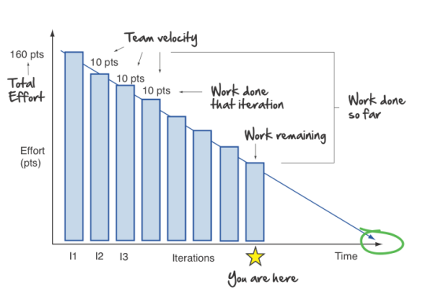

[Home](README.md) | [Why](why.md) | **[Pillars](pillars.md)** | [Systems](systems.md) | [Team](team-model.md)

# Management Reporting

Management Reporting is critical to inform management, project investors and the overall executive how the project is performing. It consists of the following key outcomes.

## Outcomes

* Burndown
* Test and Regression Rates
* Development Cadence
* Estimated Dates
* Cost and Duration

## How

Management reporting is normally delivered through a combination of reports, graphs, and charts.

Each of the outcomes and their required reports is shown below:

## Burndown

The burndown is a chart that shows how quickly you and your team are burning through user stories. It shows the total effort against the amount of work we deliver each iteration.

We can see the total effort on the left and our team's velocity on the right. This graph also gives us:
* Work done each Iteration
* Work remaining
* Work done so far
* When we can expect to be done

An example Burndown spreadsheet is available [here](http://www.agilenutshell.com/assets/Sample-Burndown.xls)

## Test and Regression Rates

As a development project continues on, testing rates should increase and an increasing number of bugs should be found. As a sprint or phase nears completion, the active bugs should reduce to zero (zero-bug-bounce). This does not mean you have zero bugs, but means you have fixed all the ones currently found.

Regressions are tests which previously passed and now fail due to a change. It's key to have good automated testing to ensure that regression rates are kept low.

